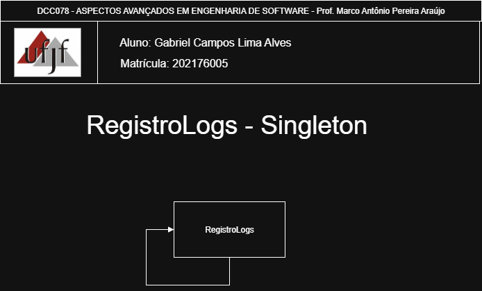

# Singleton — Sistema de Registro de Logs

<p align="center">
  <a href="https://www.ufjf.br/" rel="noopener">
    
  </a>
</p>

<h3 align="center">DCC078-2025.3-A — Aspectos Avançados em Engenharia de Software (UFJF/ICE)</h3>

---

## 📝 Sumário
- [Sobre](#sobre)
- [Diagrama Nível de Projeto](#diagrama)
- [Funcionalidades](#funcionalidades)
- [Tecnologias](#tecnologias)
- [Exemplo de Uso](#exemplo)
- [Como Executar e Testes](#testes)
- [Autor](#autor)

## 🧐 Sobre <a name="sobre"></a>
> **Disciplina:** DCC078 – Aspectos Avançados em Engenharia de Software  
> **Projeto:** Sistema de Registro de Logs com Singleton
> **Docente:** Prof. Marco Antônio Pereira Araújo
> **Data de entrega:** 07/10/2025  
> **Aluno:** [Gabriel Campos Lima Alves](#autor)

### Padrão Singleton
Implementação do padrão **Singleton** para criação de um sistema centralizado de registro de logs da aplicação.
O **Singleton** é um padrão criacional que garante que uma classe tenha apenas uma instância e fornece um ponto de acesso global a ela, demonstrando:
- Instância única compartilhada em toda a aplicação
- Acesso global controlado através de `getInstance()`
- Thread-safety por inicialização eager (estática)

## 📐 Diagrama de Classe <a name="diagrama"></a>
O diagrama abaixo representa a arquitetura do projeto, destacando a aplicação do padrão **Singleton** no sistema de logs:

<p align="center">
  
</p>

## 🚀 Funcionalidades <a name="funcionalidades"></a>
### Sistema de Logs Implementado
- **RegistroLogs**: Classe Singleton para gerenciamento centralizado de logs

### Recursos
- ✅ Instância única garantida pelo padrão Singleton
- ✅ Registro de logs com múltiplos níveis (INFO, ERROR, WARNING)
- ✅ Persistência automática em arquivo
- ✅ Validações com exceptions (IllegalArgumentException, IOException)
- ✅ Formatação automática com timestamp e identificação de usuário
- ✅ Compartilhamento de estado entre todas as referências

##  Tecnologias <a name="tecnologias"></a>
- **Java 11+**
- **JUnit 5** - Framework de testes
- **Maven** - Gerenciamento de dependências
- **Git** - Controle de versão


## 📊 Exemplo de Uso <a name="exemplo"></a>
```java
// Obtendo a instância única (Singleton)
RegistroLogs logs = RegistroLogs.getInstance();

// Configurando o sistema
logs.setCaminhoArquivo("logs/aplicacao.log");
logs.setUsuarioAtivo("admin");

// Registrando logs
logs.registrar("Aplicação iniciada");
logs.registrar("INFO", "Sistema configurado");
logs.registrar("ERROR", "Exemplo de erro");

// Verificando que é Singleton
RegistroLogs logs2 = RegistroLogs.getInstance();
System.out.println(logs == logs2); // true - mesma instância

// Compartilhamento de estado
System.out.println(logs2.getLogs().size()); // Acesso aos mesmos logs
```

## 🧪 Como Executar e Testes <a name="testes"></a>
### Cobertura de Testes
- ✅ **Testes de Configuração**: Validam getters e setters
- ✅ **Testes de Validação**: Verificam exceptions para parâmetros inválidos
- ✅ **Testes do Padrão**: Confirmam comportamento Singleton

### Pré-requisitos
- Java 11 ou superior
- Maven 3.6+

### Comandos
```bash
# Compilar o projeto
mvn clean compile

# Executar testes
mvn test

# Empacotar
mvn package
```

## 👨‍💻 Autor <a name="autor"></a>
**Gabriel Campos Lima Alves**  
Matrícula: 202176005  
Email: campos.gabriel@estudante.ufjf.br  
GitHub: [@CamposCodes](https://github.com/CamposCodes)

---

*Projeto de uso acadêmico exclusivo para a disciplina DCC078 - UFJF*